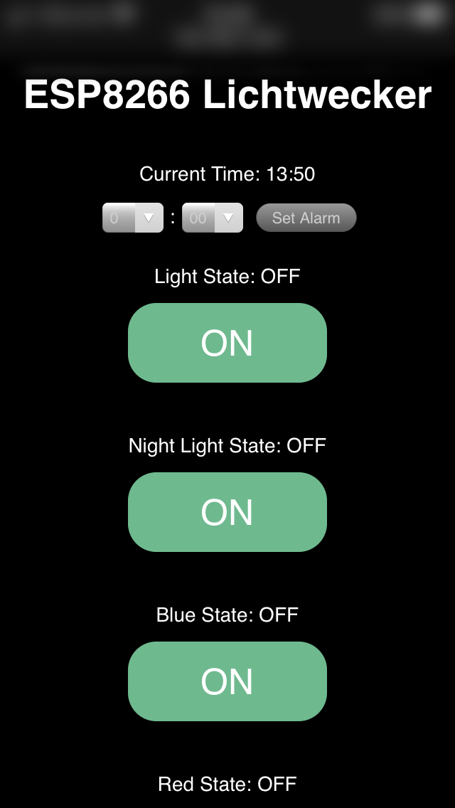
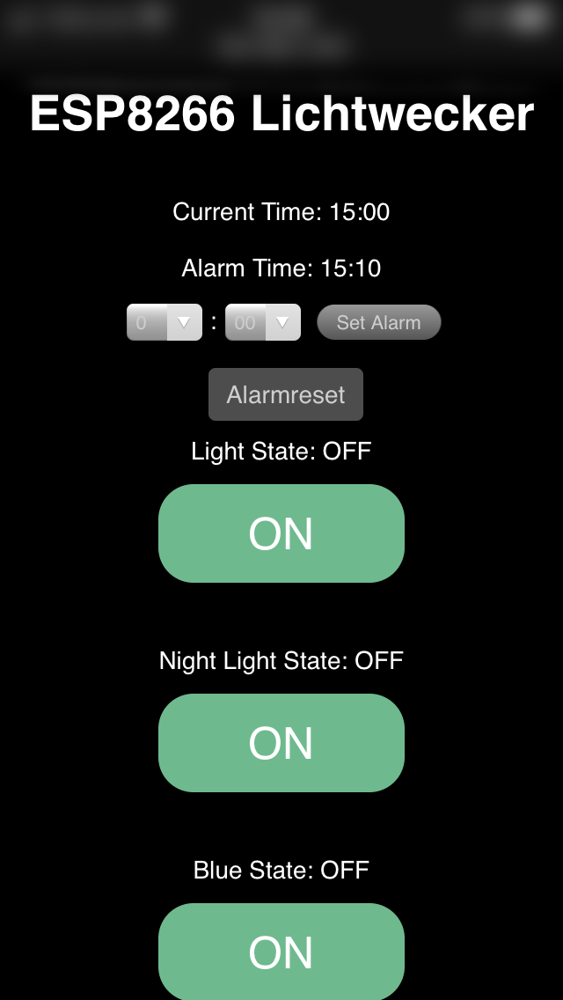

# WiFi-Sunrise-Alarm-Clock

ESP8266 microcontroller with DS3231m RTC to control an RGBW LED strip and turn it into a web interfaceable sunrise alarm (Lichtwecker!)

## Idea

Making a DIY sunrise alarm with a RGBW LED strip that can be controlled through a web browser. The simulated sunrise that wakes you up softly.

## Setup & Functions

In this project I used an Adafruit Feather Huzzah ESP8266, with DS3231m RTC to control a RGBW LED strip through N-channel MOSFET's. The microcontroller is connected to the home WiFi network and can be controlled from any device that can run a browser. 

A parts list and more detailed descriptions of the project (schematics, PCB desgin, etc.) can be found on http://www.mypagewillcomelater.com/

### Functions

 

* toggle individual LED's with corresponding buttons (Red, Green, Blue or White)
* toggle "Night Light" (mix of RGB to give a soft purple light)
* set alarm time (in 24h format)
* reset button, which will appear after setting the alarm time
* LED strip blinks red when RTC can not be initialized


## Getting Started

Replace WiFi-Name and WiFi-Password with your credentials:
```c
// SSID of WiFi network and password of WiFi network
const char* ssid = "WiFi-Name";
const char* password = "WiFi-Password"; 
```

Change Pins to whatever you are using:
```c
//Assigning variables for LED pins
uint8_t WHITEpin = 15;
uint8_t BLUEpin = 13;
uint8_t REDpin = 14;
uint8_t GREENpin = 12;
```

Set intial time of RTC by uncommenting this line and changing arguments to the current time. Comment this line again and upload it to the microcontroller again. The DS3231(M) can also fetch the time automatically from the internet. I didn't want to depend on a internet connection with this code though and choose to manually set the time and date. Once the time is set, the DS3231(M) is very reliable and can hold the time until the 3V battery runs out (years, if not decades).
```c
  //DS3231M.adjust(DateTime(2020, 4, 4, 13, 04, 00)); // Sets time of DS3231M
```

The alarmlight() function tells the microcontroller what to do during the alarm and be changed to customize the sunrise simulation or trigger completely different features light strobe light for example.
```c
//Definition of custom functions for calling certain URLs and turning the alarm light on
//Alarm light function that slow turns on LEDs, mimicking sunrise;
void alarmlight()                                     
{
  for (uint16_t r = 0; r < 1024; r++) 
    { 
    analogWrite(REDpin, r);
    delay(FADESPEED);
    }
  for (uint16_t g = 0; g < 1024; g++) 
    { 
    analogWrite(GREENpin, g);
    delay(FADESPEED);
    }
  for (uint16_t b = 0; b < 512; b++) 
    { 
    analogWrite(BLUEpin, b);
    delay(FADESPEED);
    } 
  for (uint16_t w = 0; w < 1024; w++) 
    { 
    analogWrite(WHITEpin, w);
    delay(FADESPEED);
    }
Lightstatus = HIGH;
Bluestatus = HIGH;
Redstatus = HIGH;
Greenstatus = HIGH;
}
```

The output and style of the HTML page can be customized in the SendHTML string. 

```html
//Strings hold HTML and CSS styling
String SendHTML(uint8_t lightstat,uint8_t nightlightstat,uint8_t bluestat,uint8_t redstat,uint8_t greenstat, uint8_t actualhh, uint8_t actualmm, uint8_t alarmhh, uint8_t alarmmm){
  String ptr = "<!DOCTYPE html> <html>\n";
  ptr +="<head><meta name='viewport' content='width=device-width, initial-scale=1.0, user-scalable=no'>\n";
  ptr +="<title>Lichtwecker</title>\n";
  ptr +="<style>html {background-color: black;font-family: Helvetica; display: inline-block; margin: 0px auto; text-align: center;}\n";
  ptr +="body{margin-top: 50px;color: white;font-size: 14px} h1 {color: #fff;margin: 50px auto 30px;} h3 {color: #444444;margin-bottom: 50px;}\n";
  ptr +=".button {display: block;width: 80px;background-color: #1abc9c;border: none;color: white;padding: 13px 30px;text-decoration: none;font-size: 25px;margin: 0px auto 35px;cursor: pointer;border-radius: 20px;}\n";
  ptr +=".button-on {background-color: #6FB98F;}\n";
  ptr +=".button-on:active {background-color: #45BD79;}\n";
  ptr +=".button-off {background-color: #F18D9E;}\n";
  ptr +=".button-off:active {background-color: #EE5972;}\n";
  ptr +=".time {margin-right: 5px;margin-left: 5px;padding: 5px 10px;border: none;border-radius: 4px;background-color: #4d4d4d;color: #cecece;}\n";
  ptr +=".submit {margin-left: 5px;padding: 6px 10px;border: none;border-radius: 4px;background-color: #4d4d4d;color: #cecece;text-decoration: none}\n";
  ptr +=".form {margin: 0px auto 20px;}\n";
  ptr +="p {font-size: 14px;color: #fff;margin-bottom: 10px;}\n";
  ptr +="</style>\n";
  ptr +="</head>\n";
  ptr +="<body>\n";
  ptr +="<h1>ESP8266 Lichtwecker </h1>\n";
  ptr +="<p>Current Time: ";
  ptr +=(int)actualhh;
  ptr +=":";
  if (actualmm < 10) // Display leading zeros
  {ptr +="0";}
  ptr +=(int)actualmm;
  ptr +="</p>\n";
  if (alarmhh < 61) // Show alarm time when it is set to value within range of actual time
  {ptr +="<p>Alarm Time: ";
  ptr +=(int)alarmhh;
  ptr +=":";}
  if(alarmmm < 10) // Display leading zeros
  {ptr +="0";}
  if(alarmmm < 61) // Show alarm time when it is set to value within range of actual time
  {ptr +=(int)alarmmm;
  ptr +="</p>\n";}

  // HTML dropdown form to set the alarm time
  ptr +="<form class='form' method ='GET' action='/alarmtime'>";
  ptr +="<select class='time' name = hour>";
  ptr +="<option value='0'>0</option>";
  ptr +="<option value='1'>1</option>";
  ptr +="<option value='2'>2</option>";
  ptr +="<option value='3'>3</option>";
  ptr +="<option value='4'>4</option>";
  ptr +="<option value='5'>5</option>";
  ptr +="<option value='6'>6</option>";
  ptr +="<option value='7'>7</option>";
  ptr +="<option value='8'>8</option>";
  ptr +="<option value='9'>9</option>";
  ptr +="<option value='10'>10</option>";
  ptr +="<option value='11'>11</option>";
  ptr +="<option value='12'>12</option>";
  ptr +="<option value='13'>13</option>";
  ptr +="<option value='14'>14</option>";
  ptr +="<option value='15'>15</option>";
  ptr +="<option value='16'>16</option>";
  ptr +="<option value='17'>17</option>";
  ptr +="<option value='18'>18</option>";
  ptr +="<option value='19'>19</option>";
  ptr +="<option value='20'>20</option>";
  ptr +="<option value='21'>21</option>";
  ptr +="<option value='22'>22</option>";
  ptr +="<option value='23'>23</option>";
  ptr +="</select>";
  ptr +=":";
  ptr +="<select class='time' name= minute>";
  ptr +="<option value='00'>00</option>";
  ptr +="<option value='10'>10</option>";
  ptr +="<option value='20'>20</option>";
  ptr +="<option value='30'>30</option>";
  ptr +="<option value='40'>40</option>";
  ptr +="<option value='50'>50</option>";
  ptr +="</select>";
  ptr +="<input class='submit' type='submit' value='Set Alarm'>";
  ptr +="</form>\n"; 

  // Display alarm reset button when alarm is set to value within range of actual time
  if(alarmhh < 61 && alarmmm < 61)
  {ptr +="<a class='submit' href='/alarmreset'>Alarmreset</a>\n";}

  // If function that will either show the "ON" or "OFF" button for LEDs
  if(lightstat)
  {ptr +="<p>Light State: ON</p><a class='button button-off' href='/lightoff'>OFF</a>\n";}
  else
  {ptr +="<p>Light State: OFF</p><a class='button button-on' href='/lighton'>ON</a>\n";}

  if(nightlightstat)
  {ptr +="<p>Night Light State: ON</p><a class='button button-off' href='/nightlightoff'>OFF</a>\n";}
  else
  {ptr +="<p>Night Light State: OFF</p><a class='button button-on' href='/nightlighton'>ON</a>\n";}

  if(bluestat)
  {ptr +="<p>Blue State: ON</p><a class='button button-off' href='/blueoff'>OFF</a>\n";}
  else
  {ptr +="<p>Blue State: OFF</p><a class='button button-on' href='/blueon'>ON</a>\n";}

  if(redstat)
  {ptr +="<p>Red State: ON</p><a class='button button-off' href='/redoff'>OFF</a>\n";}
  else
  {ptr +="<p>Red State: OFF</p><a class='button button-on' href='/redon'>ON</a>\n";}

  if(greenstat)
  {ptr +="<p>Green State: ON</p><a class='button button-off' href='/greenoff'>OFF</a>\n";}
  else
  {ptr +="<p>Green State: OFF</p><a class='button button-on' href='/greenon'>ON</a>\n";}

  ptr +="</body>\n";
  ptr +="</html>\n";
  return ptr;
}
```
